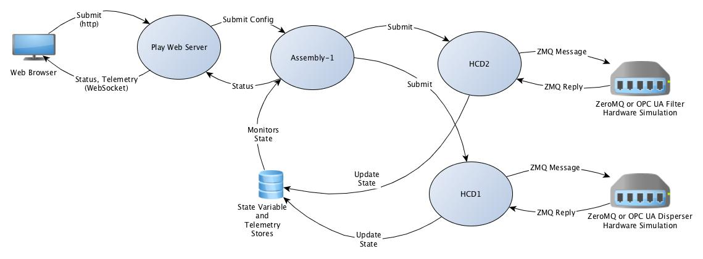

CSW Command Service Package Demo
================================

This project contains standalone applications for testing the command service, 
Container, Assembly and HCD components and is based on
the document "OSW TN009 - TMT CSW PACKAGING SOFTWARE DESIGN DOCUMENT".

ZeroMQ Native Lib Dependency
----------------------------

In this demo the hardware layer accessed by the HCDs is simulated by a
C/ZeroMQ based process, which needs to be built separately using `make`.
The hardware simulation server is called mtserver2 and the sources are under the "hardware" directory.
The Akka ZeroMQ support currently requires ZeroMQ version 2.2.
The Scala code picks up the shared library automatically if it is installed in /usr/lib or /usr/local/lib.
The required library name on the Mac is libzmq.1.dylib.

Sbt Build
---------

To compile the Scala/Akka code, type "sbt" and then:

* compile
* stage

The stage task creates the distribution with the scripts for the applications
(found under the target/universal/stage/bin directories).

Note: See <a href="https://github.com/tmtsoftware/csw-extjs">csw-extjs</a> for how to setup the ExtJS
based web UI used below. You need to install and run some "sencha" commands once to prepare the web app, otherwise
the generated CSS file will not be found and the web app will not display properly.

To run the demo: Open terminal windows or tabs in these directories and run these commands:

* cd hardware/src/main/c; mtserver2 filter
* cd hardware/src/main/c; mtserver2 disperser

Optionally, if you want to test with the 
<a href="https://github.com/tmtsoftware/csw-play-demo">play-demo</a> web app:

* cd hardware/src/main/c; mtserver2 pos    # last part of config path for base pos and ao pos
* cd hardware/src/main/c; mtserver2 one

Start the location service (This has to be running before any HCDs or assemblies are started):

* cd ../csw/loc/target/universal/stage/bin; ./loc

Then start the two Akka containers (The order is not important here):

* cd container2/target/universal/stage/bin; ./container2
* cd container1/target/universal/stage/bin; ./container1

Note: Instead of starting container2, you can do this:

* cd containerX; bash containerX.sh

This uses the sbt launcher and some configuration files to run the equivalent of container2.
See [containerX](containerX/README.md) for more information.

Optionally start the <a href="https://github.com/tmtsoftware/csw-play-demo">play-demo</a> web app:

* cd ../play-demo; play run            # then open http://localhost:9000 in a browser

Or: Access the Spray/ExtJS based web app:

* open http://localhost:8089 in a browser for the Ext JS version and select the development
(JavaScript source) or production (compiled, minified) version. Note that you need to
compile the ExtJS code at least once to get the required CSS file generated.
See <a href="https://github.com/tmtsoftware/csw-extjs">csw-extjs</a> for instructions.

Enter the values in the form and press Submit. The status of the command is shown below the button and updated
while the command is running.

TODO: Add the ability to pause and restart the queue, pause, cancel or abort a command, etc.

The following diagram shows the relationships of the various containers, assemblies and HCDs in this demo:

When the user fills out the web form and presses Submit, a JSON config is sent to the Spray/REST HTTP server
of the Assembly1 command service. It forwards different parts of the config to HCD1 and HCD2, which are in
a different container and JVM, but are registered as components with Assembly1, so that it forwards parts of
configs that match the keys they registered with.

HCD1 and HCD2 both talk to the C/ZeroMQ based hardware simulation code and then return a command status to the
original submitter (Assembly1).

The Play Framework code uses long polling (to the Spray HTTP server) to get the command status and then
uses a websocket and Javascript code to push the status to the web page.
